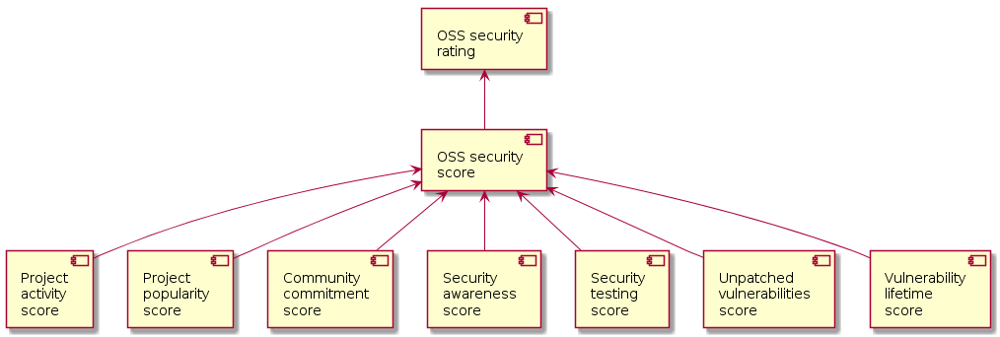

# Open-source security rating

This section describes a security rating for open-source projects.
The rating is implemented in the [OssSecurityRating](../src/main/java/com/sap/sgs/phosphor/fosstars/model/rating/oss/OssSecurityRating.java) class.

## Features

Here is a list of features which are currently used in the open-source security rating.
Implementations of the features can be found in
[com.sap.sgs.phosphor.fosstars.model.feature.oss](../src/main/java/com/sap/sgs/phosphor/fosstars/model/feature/oss) package.

1.  Info about vulnerabilities in open-source project.
1.  If an open-source project is regularly scanned for vulnerable dependencies.
1.  If an open-source project has a security team.
1.  If an open-source project has a security policy.
1.  Security reviews for an open-source project.
1.  If an open-source project belongs to Apache Foundation.
1.  If an open-source project belongs to Eclipse Foundation.
1.  If an open-source project is supported by a company.
1.  Number of commits last three months.
1.  Number of contributors last three months.
1.  Number of watchers for a GitHub repository.
1.  Number of stars for a GitHub repository.
1.  When first commit was done.
1.  When a project started.

## Scores

The open-source security rating is based on open-source security score
which is implemented in the [OssSecurityScore](../src/main/java/com/sap/sgs/phosphor/fosstars/model/score/oss/OssSecurityScore.java) class.

Here is a list of sub-scores which are currently used in the open-source security score.
Implementations for all the scores can be found in the [com.sap.sgs.phosphor.fosstars.model.score.oss](../src/main/java/com/sap/sgs/phosphor/fosstars/model/score/oss) package.

1.  Security testing score based on the following features:
    1.  If an open-source project is regularly scanned for vulnerable dependencies.
    1.  Security reviews for an open-source project.
1.  Unpatched vulnerabilities score based on the following features:
    1.  Info about vulnerabilities in open-source project.
    1.  When first commit was done.
    1.  When a project started.
1.  Vulnerability lifetime score based on the following features:
    1.  Info about vulnerabilities in open-source project.
1.  Security awareness score based on the following features:
    1.  If an open-source project has a security team.
    1.  If an open-source project has a security policy.
1.  Project activity score based on the following features:
    1.  Number of commits last three months.
    1.  Number of contributors last three months.
1.  Project popularity score based on the following features:
    1.  Number of watchers for a GitHub repository.
    1.  Number of stars for a GitHub repository.
1.  Community commitment score based on the following features:
    1.  If an open-source project belongs to Apache Foundation.
    1.  If an open-source project belongs to Eclipse Foundation.
    1.  If an open-source project is supported by a company.

## Features and scores to be considered

Here is a list of features, scores and data sources which can also be considered.

1.  Static analysis score. This score should be included to the security testing score.
    Here is a list of features which can contribute to this score:
    1.  If a project uses Coverity.
    1.  If a project uses LGTM.
    1.  If a project uses FindSecBugs.
1.  Dynamic analysis score. This score should be included to the security testing score.
    Here is a list of features which can contribute to this score:
    1.  If a project uses languages which allow direct memory access (for example, C/C++).
    1.  If a project uses AddressSanitizer.
    1.  If a project uses UndefinedBehaviorSanitizer.
    1.  If a project uses ThreatSanitizer.
1.  Memory safety score. This score describes how likely a memory-corruption vulnerability may be introduced.
    Here is a list of features which can contribute to this score:
    1.  If a project uses languages which allow direct memory access (for example, C/C++).
    1.  If a project uses static analysis.
    1.  If a project uses memory sanitizers.
1.  Threat modeling. This feature tells if a project does threat modeling.
    Here is a couple of ideas how this features can be filled out:
    1.  Look for files which may contain a threat model, for example, `threatmodel.md`.
    1.  Check if a project uses [threatspec](https://github.com/threatspec/threatspec).
1.  CI/CD score. This score describe if and how a project uses CI/CD.
    Here is a list of features which can contribute to this score:
    1.  If a project uses Travis.
    1.  If a project uses CircleCI.
    1.  If a project uses GitHub actions.
    1.  If a project uses Jenkins.
1.  If a project uses `nohttp`.
1.  Here is a list of dependency scanners which can be considered to fill the corresponding feature:
    1.  OWASP Dependency Check with Maven and Gradle.
    1.  Snyk.
    1.  Whitesource.
    1.  Dependabot.

---

Next: [Alternatives](alternatives.md)
