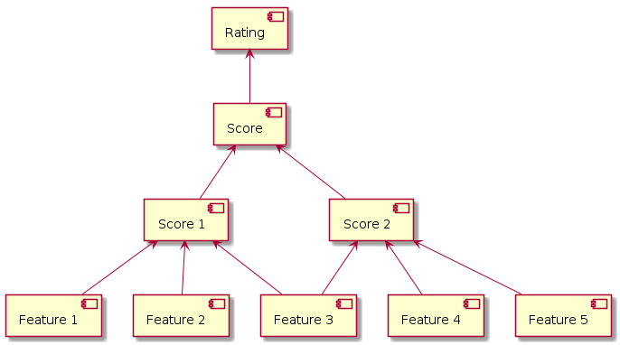

# Defining a rating for an open source project

This page provides definitions for a feature, a score and a rating.
Then, it describes how a rating for an open source project can be defined.

## Feature

Various data may be used to build a rating for an open source project.
The data may be very diverse and may have different types.

Let's define a **feature** as a measurable characteristic of an open source project.
A feature has a type and may have constraints.

Here are several examples of features, their types and constraints:

*  Number of commits last month (a non-negative integer)
*  CVSS scores for vulnerabilities (a float number from 0 to 10)
*  Date of the latest release (date)
*  Supported by a company (boolean, yes or no)

## Scoring function

A number of features may describe a particular property of an open source project.

Let's define a **scoring function** as a procedure that takes a number of features or scores
and produces a float number in the interval `[0, 10]`.
The number is a **score** that describes a particular property of an open source project.
The higher a score value is, the better a property is implemented in an open source project.
A score can be also called a synthetic feature.

Here are several examples of scores:

*  Security awareness score describes how well maintainers and community of an open source project
   care about security. The security awareness score may be based on user's opinions about the topic,
   presence of a security team, etc.
*  Unpatched vulnerabilities score describes
   how unpatched vulnerabilities impact security of an open source project.
   The unpatched vulnerabilities score may be based on a total number of vulnerabilities,
   a total number of unpatched vulnerabilities, CVSS scores for the unpatched vulnerabilities, etc.
*  Security testing score describes how well security testing is being performed for an open source project.
   The security testing score may be based on a history of security reviews, security tests,
   static code analysis, fuzzing, etc.
*  Project activity score describes how alive an open source project is.
   The project activity score may be based on statistics from a code repository
   such as a number of commits last month, a number of contributors last month, etc.
*  Commitment score describes how well maintainers and community of an open source project is committed
   to support the project. The commitment score may be based on a number of active maintainers,
   presence of a company that sponsors the project, etc.

## Rating procedure

A number of properties of an open source project may be combined
in order to describe a more general property of the project.

Let's define a **rating procedure** as a combination of a scoring function,
a set of labels and a **label function** that maps a score to one of the defined labels.
First, a rating procedure takes a set of feature values and passes them to the scoring function.
Next, the scoring function produces a score value. Then, the label function
converts the score to a label.

In other words, a rating procedure interprets a score by mapping it to a label.

For example, a security rating procedure for an open source project is based on a score function
that assesses security level in the project.
The rating procedure may then return `GOOD` label if a score is greater than 7.0,
and `BAD` label otherwise.

## Hierarchy of features, scoring functions and rating procedures

Dependencies between features, scoring functions and rating procedures may be described as a graph.



The graph looks like a tree. In this graph, a rating procedure is the root of the tree,
scoring functions are nodes, and features are leafs.
Strictly speaking, the graph is not a tree because a feature can contribute to multiple scores,
so that the graph may have loops.

## Unknown values for features

It may happen that a value for a feature couldn't be gathered for some reasons.
In this case, a feature value is **unknown**.
A score should expect unknown values and still produce a score.

## Not applicable scores

It may happen that a score makes sense for one project, but doesn't make much sense for another one.
In this case, the scoring function may return a special value **Not Applicable** which means
that the scoring function can't be applied to the project.

## Defining a rating procedure

The following steps describe how a rating procedure may be built:

1.  Define a set of features `F = { f[1], f[2], ... , f[N] }`.
1.  Define a set of scoring functions `S = { s[1], s[2], ... , s[M] }`.
1.  For each scoring function `s[i]` where `i = 1..M`:
    1.  Assign a set of features `F_s[i]` that are used by a scoring function `s[i]`.

        Each set `F_s[i]` is a subset of `F`. The sets `F_s[i]` may overlap.
    2.  Define a scoring function `s[i]` that takes features from `F_s[i]`
        and return a score in the interval `[0, 10]`.

        In other words, `s[i]: F_s[i] -> [0, 10]`.
    3.  For each scoring function `s[i]`, assign a weight `w[i]` in the interval `(0, 1]`.
1.  Define an overall scoring function `s*` that is based on the scoring functions `s[i]`.
    The overall scoring function `s*` takes a vector of features `f[i]`
    and calculates a weighted average of scores produced by scoring functions `s[i]`:

    ```
    def overall_score(v) {
        score = 0
        sum_of_weights = sum of w[i] for i=1..M
        for i in 1..M
            F_s_v = select F_s[i] values from v
            score = score + w[i] * score[i](F_s_v)
        return score / sum_of_weights
    }
    ```

    The weight `w[i]` defines how much the scoring function `s[i]` contributes to the overall score.
    In other words, the weight `w[i]` defines the importance of the scoring function `s[i]`.

    The function `overall_score(v)` always returns a number in the interval `[0, 10]`.
1.  Define a set of labels `L = { l[1], ... , l[K] }`.
1.  Define a function `label(s)` that maps a score value `s` to one of the labels from `L`.

    In other words, `label[s]: s -> l` where `r` belongs to the interval `[0, 10]` and `l` belongs to `L`.
1.  Finally, define a rating procedure `r` as a combination of the scoring function `s*`,
    the set of labels `L`, and the label function `label(s)`.

---

Next: [Example](example.md)
